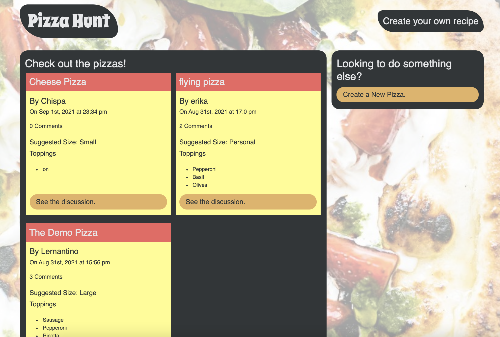

# pizza-hunt

## Description
Pizza-Hunt is a web app create for the company and pizza store, pizza-hunt. The user is able to create their on pizza and be able to see other popular pizza rescipes. 
This app is built using Mongoose. 

## Screenshot

## Deployment

[Link](https://obscure-hamlet-00557.herokuapp.com/)

## Table of Contents (Optional)

If your README is very long, add a table of contents to make it easy for users to find what they need.

* [Installation](#installation)
* [Usage](#usage)
* [Credits](#credits)
* [License](#license)

## Installation

`npm i` 

## Usage 

To use the 
1. Open the terminal 
2. Run `npm start`
3. Open localhost on browser

---

🏆 
## Badges

## Contributing / Credits

[mariamv29](https://github.com/mariamv29/README-generator.git)
